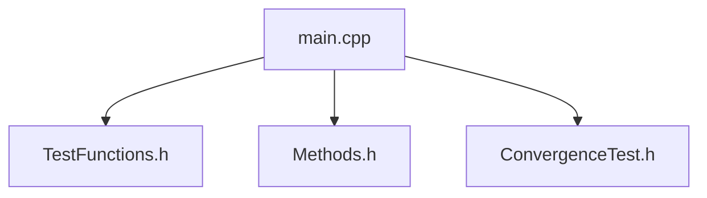

## 📋 Содержание
1. [Цель работы](#цель-работы)
2. [Теоретическая база](#теоретическая-база)
3. [Структура программы](#структура-программы)
4. [Детальное описание файлов](#детальное-описание-файлов)
7. [Результаты вычислений](#результаты-вычислений)
8. [Анализ полученных данных](#анализ-полученных-данных)
9. [Выводы](#выводы)

---

## <a name="цель-работы"></a>🎯 Цель работы
Реализация и сравнительный анализ методов численного интегрирования
- Составная формула трапеций
- Составная формула Симпсона
- Квадратуры Гаусса с 3, 5 и 7 узлами

---

## <a name="теоретическая-база"></a>📚 Теоретическая база

### Что такое численное интегрирование?
Это когда мы не можем посчитать интеграл аналитически (или лень :) ), но можем приблизительно найти площадь под графиком функции.

### 📏 Метод трапеций (2-й порядок точности)
**Как работает:** Разбиваем область под графиком на трапеции и складываем их площади.


Аппроксимация подынтегральной функции f(x) с помощью (а) кусочно-линейной (метод трапеций).
h - шаг интегрирования. Он может быть как 0.1 так и 0.0001. Пример с пределом интегрирования от 0 до 1: с шагом 0.1 необходимо сделать таких шагов 10, с шагом 0.0001 - 10000

**Пример:** ∫₋₁¹ x² dx (площадь под параболой от -1 до 1)
- Берем 1 трапецию: получаем площадь 2 (грубо)
- Берем 2 трапеции: получаем 1.0 (точнее)
- Берем 4 трапеции: получаем 0.75 (еще точнее)
- Точное значение: 0.666...

**Почему 2-й порядок?** При удвоении числа трапеций погрешность уменьшается в 4 раза.

---

### 🪄 Метод Симпсона (4-й порядок точности)
**Как работает:** Вместо прямых линий (как в трапециях) используем параболы - они лучше повторяют форму графика.


Аппроксимация подынтегральной функции f(x) с помощью (а) кусочно-линейной (метод трапеций) и (б) кусочно-квадратичной (метод Симпсона) функций.
P2 — интерполяционный полином Лагранжа второй степени. Простым языком - парабола.


**Пример:** Тот же ∫₋₁¹ x² dx
- 2 интервала: сразу получаем 0.66667 (почти точно!)
- 4 интервала: 0.66667 (уже идеально)

**Почему 4-й порядок?** При удвоении числа интервалов погрешность уменьшается в 16 раз.

---

### ⭐ Методы квадратур Гаусса–Лежандра
**Как работают:** Самые умные методы. Они не делят отрезок на части, а выбирают специальные точки (узлы), где нужно посчитать функцию, чтобы получить максимальную точность.


(а) - аппроксимация подынтегральной функции f(x) с помощью метода трапеций
(б) - аппроксимация подынтегральной функции f(x) с помощью метода квадратур
Знаками “+” и “–” отмечены погрешности аппроксимации. Видно, что в методе квадратур погрешности могут быть скомпенсированы за счет
выбора оптимальных узлов.


**Пример с ∫₋₁¹ x⁶ dx:**
- Гаусс-3 (3 точки): ошибка 0.0457
- Гаусс-5 (5 точек): ошибка 0 (идеально!)
- Гаусс-7 (7 точек): тоже идеально

**Почему так точно?** Потому что узлы - это корни полиномов Лежандра (специальные многочлены), которые оптимальны для интегрирования.

---

### Про точность методов 

| Метод | Порядок точности | Точен для полиномов | Точная оценка для |
|-------|------------------|---------------------|-------------------|
| Трапеции | 2-й (O(h²)) | 0-1 степень | 2 степень |
| Симпсон | 4-й (O(h⁴)) | 0-3 степень | 4 степень |
| Гаусс-3 | 5-й | 0-5 степень | 6 степень |
| Гаусс-5 | 9-й | 0-9 степень | 10 степень |
| Гаусс-7 | 13-й | 0-13 степень | 14 степень |

###  Для каких функций подходят

| Тип функции | Какой метод брать | Почему |
|-------------|-------------------|--------|
| Ровные, гладкие (cos, sin, экспоненты) | **Симпсон или Гаусс** | Быстро и точно |
| С углами, резкие перепады | **Трапеции** | Простые методы не любят резких скачков |
| Полиномы (x², x³, x⁴...) | **Гаусс** | Для полиномов 5 степени хватит 3 точек! |
| Вообще непонятно че)) | **Симпсон** | Золотая середина |


---

## <a name="структура-программы"></a>🏗️ Основная структура программы


---

## <a name="детальное-описание-файлов"></a>📄 Детальное описание файлов

### 1. `TestFunctions.h` - тестовые функции и аналитика

**Назначение:** Содержит набор функций для тестирования методов интегрирования:
- Полиномы различных степеней (0-6)
- Тригонометрические функции для исследования сходимости
- Точные аналитические значения интегралов
- Оценки главного члена погрешности

**Состав:**

| Категория | Функции | Описание |
|-----------|---------|----------|
| **Полиномы** | `poly0()` - `poly6()` | Тестовые полиномы от x⁰ до x⁶ |
| **Тригонометрия** | `trig_func()` | `cos(x)` для исследования сходимости |
| **Точные значения** | `exact_poly0()` - `exact_poly6()`<br>`exact_trig()` | Аналитические значения интегралов |
| **Оценки погрешности** | `trapezoid_error_estimate()`<br>`simpson_error_estimate()` | Теоретические оценки главного члена |

**Ключевые константы:**
- `H = 2.0` - толщина оболочки
- `A = -1.0` - нижний предел интегриованяи
- `B = 1.0` - верхний предел интегрирования

---

### 2. `Methods.h` - реализация численных методов интегрирования

**Назначение:** Содержит функции для вычисления определенных интегралов различными численными методами.

| Метод | Функция | Порядок точности | Особенности |
|-------|---------|------------------|-------------|
| **Трапеции** | `composite_trapezoid()` | 2-й (`O(h²)`) | Составная формула на равномерной сетке |
| **Симпсон** | `composite_simpson()` | 4-й (`O(h⁴)`) | Требует четного числа интервалов |
| **Гаусс-3** | `get_gauss_3()` → `gauss_3()` | 5-й | Корни P₃(x): ±√(3/5), 0 |
| **Гаусс-5** | `get_gauss_5()` → `gauss_5()` | 9-й | Корни полинома Лежандра P₅(x) |
| **Гаусс-7** | `get_gauss_7()` → `gauss_7()` | 13-й | Корни полинома Лежандра P₇(x) |
| **Общий Гаусс** | `gauss_quadrature()` | 2n-1 | Универсальная функция для n=3,5,7 |

**Преобразование координат для Гаусса:**
```cpp
x = (b + a)/2 + (b - a)/2 * t_k  // отображение [-1,1] → [a,b]
```

### 3. `ConvergenceTest.h` - исследование сходимости

**Назначение:** Анализ скорости сходимости методов при измельчении сетки.

| Компонент | Назначение |
|-----------|------------|
| `ConvergenceResult` | Структура для хранения результатов (n, errors, orders) |
| `test_trapezoid_convergence()` | Исследование сходимости метода трапеций |
| `test_simpson_convergence()` | Исследование сходимости метода Симпсона |
| `print_convergence()` | Вывод таблицы сходимости в файл |

**Порядок точности:** `order = log2(prev_error / current_error)`

**Ожидания:**
- Трапеции: order ≈ 2.0 (погрешность убывает в 4 раза)
- Симпсон: order ≈ 4.0 (погрешность убывает в 16 раз)

---

### 4. `main.cpp` - управление тестированием

**Назначение:** Точка входа, реализация сценариев тестирования.

| Функция | Назначение |
|---------|------------|
| `print_header()` | Вывод заголовка раздела |
| `print_subheader()` | Вывод подзаголовка |
| `test_gauss_on_polynomials()` | Тестирование Гаусса на полиномах x^0-x^6 |
| `test_trapezoid()` | Полное тестирование метода трапеций |
| `test_simpson()` | Полное тестирование метода Симпсона |
| `test_gauss_precision()` | Проверка границ точности Гаусса |
| `compute_shell_forces()` | Расчет усилия N и момента M |
| `main()` | Запуск всех тестов |

---
