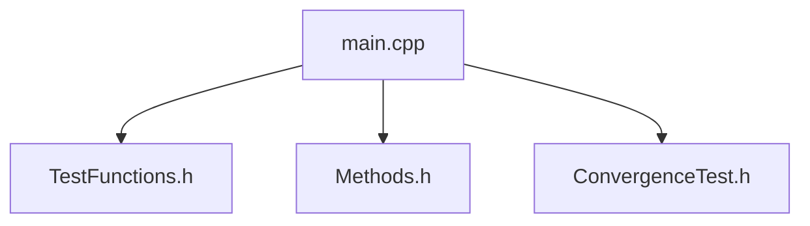

## 📋 Содержание
1. [Цель работы](#цель-работы)
2. [Теоретическая база](#теоретическая-база)
3. [Структура программы](#структура-программы)
4. [Детальное описание файлов](#детальное-описание-файлов)
5. [Численные методы](#численные-методы)
6. [Тестирование и верификация](#тестирование-и-верификация)
7. [Результаты вычислений](#результаты-вычислений)
8. [Анализ полученных данных](#анализ-полученных-данных)
9. [Выводы](#выводы)

---

## 🎯 Цель работы
Реализация и сравнительный анализ методов численного интегрирования
- Составная формула трапеций
- Составная формула Симпсона
- Квадратуры Гаусса с 3, 5 и 7 узлами

---

## 📚 Теоретическая база

### Исходные соотношения
Для оболочки толщиной `h = 2` (интервал интегрирования `[A, B] = [-1, 1]`):

### Характеристики методов

| Метод | Порядок точности | Точен для полиномов | Точная оценка для |
|-------|------------------|---------------------|-------------------|
| Трапеции | 2-й (`O(h²)`) | 0-1 степень | 2 степень |
| Симпсон | 4-й (`O(h⁴)`) | 0-3 степень | 4 степень |
| Гаусс-3 | 5-й | 0-5 степень | 6 степень |
| Гаусс-5 | 9-й | 0-9 степень | 10 степень |
| Гаусс-7 | 13-й | 0-13 степень | 14 степень |

---

## 🏗️ ОСНОВНАЯ СТРУКТУРА ПРОГРАММЫ


---

## 📄 ДЕТАЛЬНОЕ ОПИСАНИЕ ФАЙЛОВ

### 1. `TestFunctions.h` - тестовые функции и аналитика

**Назначение:** Содержит набор функций для тестирования методов интегрирования:
- Полиномы различных степеней (0-6)
- Тригонометрические функции для исследования сходимости
- Точные аналитические значения интегралов
- Оценки главного члена погрешности

**Состав:**

| Категория | Функции | Описание |
|-----------|---------|----------|
| **Полиномы** | `poly0()` - `poly6()` | Тестовые полиномы от x⁰ до x⁶ |
| **Тригонометрия** | `trig_func()` | `cos(x)` для исследования сходимости |
| **Точные значения** | `exact_poly0()` - `exact_poly6()`<br>`exact_trig()` | Аналитические значения интегралов |
| **Оценки погрешности** | `trapezoid_error_estimate()`<br>`simpson_error_estimate()` | Теоретические оценки главного члена |

**Ключевые константы:**
- `H = 2.0` - толщина оболочки
- `A = -1.0` - нижний предел
- `B = 1.0` - верхний предел

---

### 2. `Methods.h` - реализация численных методов интегрирования

**Назначение:** Содержит функции для вычисления определенных интегралов различными численными методами.

| Метод | Функция | Порядок точности | Особенности |
|-------|---------|------------------|-------------|
| **Трапеции** | `composite_trapezoid()` | 2-й (`O(h²)`) | Составная формула на равномерной сетке |
| **Симпсон** | `composite_simpson()` | 4-й (`O(h⁴)`) | Требует четного числа интервалов |
| **Гаусс-3** | `get_gauss_3()` → `gauss_3()` | 5-й | Корни P₃(x): ±√(3/5), 0 |
| **Гаусс-5** | `get_gauss_5()` → `gauss_5()` | 9-й | Корни полинома Лежандра P₅(x) |
| **Гаусс-7** | `get_gauss_7()` → `gauss_7()` | 13-й | Корни полинома Лежандра P₇(x) |
| **Общий Гаусс** | `gauss_quadrature()` | 2n-1 | Универсальная функция для n=3,5,7 |

**Преобразование координат для Гаусса:**
```cpp
x = (b + a)/2 + (b - a)/2 * t_k  // отображение [-1,1] → [a,b]
```

### 3. `ConvergenceTest.h` - анализ сходимости

| Функция | Назначение |
|---------|------------|
| `test_trapezoid_convergence()` | Исследование сходимости метода трапеций |
| `test_simpson_convergence()` | Исследование сходимости метода Симпсона |
| `print_convergence()` | Вывод результатов сходимости в файл |

---

### 4. `main.cpp` - управление тестированием

| Функция | Назначение |
|---------|------------|
| `print_header()` | Вывод заголовка раздела |
| `print_subheader()` | Вывод подзаголовка |
| `test_gauss_on_polynomials()` | Тестирование Гаусса на полиномах x⁰-x⁶ |
| `test_trapezoid()` | Полное тестирование метода трапеций |
| `test_simpson()` | Полное тестирование метода Симпсона |
| `test_gauss_precision()` | Проверка границ точности Гаусса |
| `compute_shell_forces()` | Расчет усилия N и момента M |
| `main()` | Главная функция, запускает все тесты |

---


